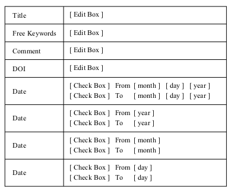

# search {#search}

## 第10章 検索 {#10}

## 1\. array xnpGetBasicInformationAdvancedSearchBlock( string modulename, array &amp;search_var ) {#1-array-xnpgetbasicinformationadvancedsearchblock-string-modulename-array-search-var}

AdvancedSearch 画面用の HTML を生成する．

### 1.1\. 画面 {#1-1}

> 

### 1.2\. 戻り値 {#1-2}

以下の構造の連想配列を返す．

> <pre class="programlisting">array(> &quot;(カラム名1)&quot; =&gt; array( > &#039;name&#039;=&gt;&quot;(カラム名HTML1)&quot;, &#039;value&#039;=&gt;&quot;(カラム値HTML1)&quot; ),> &quot;(カラム名2)&quot; =&gt; array(> &#039;name&#039;=&gt;&quot;(カラム名HTML2)&quot;, &#039;value&#039;=&gt;&quot;(カラム値HTML2)&quot; ),> (以下同様)> );</pre>

ここで (カラム名n) は，&#039;title&#039;, &#039;keywords&#039;, &#039;description&#039;, &#039;doi&#039;, &#039;publication_date&#039;, &#039;publication_year&#039;, &#039;publication_month&#039;, &#039;publication_mday&#039; のいずれかである．

### 1.3\. 送信データ {#1-3}

* $_POST[&#039;(モジュール名)_title&#039;]

* $_POST[&#039;(モジュール名)_keywords&#039;]

* $_POST[&#039;(モジュール名)_description&#039;]

* $_POST[&#039;(モジュール名)_doi&#039;]

* $_POST[&#039;(モジュール名)_publication_date_from&#039;]

* $_POST[&#039;(モジュール名)_publication_date_fromYear&#039;]

* $_POST[&#039;(モジュール名)_publication_date_fromMonth&#039;]

* $_POST[&#039;(モジュール名)_publication_date_fromDay&#039;]

* $_POST[&#039;(モジュール名)_publication_date_to&#039;]

* $_POST[&#039;(モジュール名)_publication_date_toYear&#039;]

* $_POST[&#039;(モジュール名)_publication_date_toMonth&#039;]

* $_POST[&#039;(モジュール名)_publication_date_toDay&#039;]

※ この関数は，以上全ての $_POST[] のキーを配列 $search_var に追加します．

## 2\. string xnpGetBasicInformationAdvancedSearchQuery( string moduleName ) {#2-string-xnpgetbasicinformationadvancedsearchquery-string-modulename}

モジュール名と $_POST 変数から，Basic Information を検索するような SQL の条件式を作って返す．

条件の入力が無い場合は，空文字列を返す．

## 3\. string xnpGetKeywordQuery ( string dbVarName, string postVarName ) {#3-string-xnpgetkeywordquery-string-dbvarname-string-postvarname}

DB のカラム名と Keyword から SQL の条件式を作って返す．

Keyword として，$_POST[$postVarName] を使用する．

「DBのカラムが Keyword 内の全ての単語を含む」を表すような条件式を返す．

検索条件が入力されていない場合は空文字列を返す．

> <pre class="programlisting">例:> > $_POST[$postVarName] = &#039;foo &quot;bar&#039;s fobar&quot;&#039;> $dbVarName = &#039;xoops_xnpdummy_item_detail.title&#039;> > とすると，戻り値は> > &quot;xoops_xnpdummy_item_detail.title like &#039;%foo%&#039; AND > xoops_xnpdummy_item_detail.title like &#039;%bar\&#039;s fobar%&#039;&quot;> > となる．</pre>

### 3.1\. 入力 {#3-1}

* dbVarName : DB のテーブル名.カラム名

* postVarName : POST された Keyword 変数名

### 3.2\. 戻り値 {#3-2}

SQL の条件式

## 4\. array xnpGetKeywordsQueries( array dbVarNames, array keywords ) {#4-array-xnpgetkeywordsqueries-array-dbvarnames-array-keywords}

DB のカラム名と Keyword から SQL の条件式の配列を作って返す．

戻り値の配列の [N] は，「dbVarNames の内の少なくとも 1つのカラムが Keywords[N] の文字列を含む」を意味するような条件式となる．

> <pre class="programlisting">例:> > $keywords = array(&#039;keyword1&#039;, &#039;keyword2&#039; )> $dbVarNames = array( &#039;table1.column1&#039;, &#039;table2.column2&#039; )> > とすると，戻り値は> > array(> &#039;table1.column1 like &#039;%keyword1%&#039; or table2.column2 like &#039;%keyword1%&#039;,> &#039;table1.column1 like &#039;%keyword2%&#039; or table2.column2 like &#039;%keyword2%&#039;,> )> > となる．</pre>

### 4.1\. 入力 {#4-1}

* dbVarNames : DB のテーブル名.カラム名 の配列

* keywords : Keywordの配列

### 4.2\. 戻り値 {#4-2}

SQL の条件式の配列

## 5\. array xnpKeywordsToFulltextSql( keywords ) {#5-array-xnpkeywordstofulltextsql-keywords}

keywordから、ファイル内検索用SQLの一部を作成する．

この関数は array(expression, errorMessage) を返す． この expression を利用したSQL式

<pre class="programlisting">match ( xoops_xoonips_file.search_text ) against ( &#039;$expression&#039; in boolean mode ) </pre>

は、「xoops_xoonips_fileテーブルのsearch_textカラム が、 keyword で指定された文字列を含む」という意味になる．

### 5.1\. 入力 {#5-1}

* keyword : 入力キーワード．論理式(括弧, AND, OR)を使った検索が使用可能．&quot;&quot;で囲ってフレーズ検索をすることも可能．

### 5.2\. 戻り値 {#5-2}

array( expression, errorMessage )

* expression : SQL式の一部． &quot; select .... match ( ... ) against ( $expression in boolean mode )&quot; といった形で使用可能

* errorMessage : エラーメッセージ．成功ならerrorMessage==false
